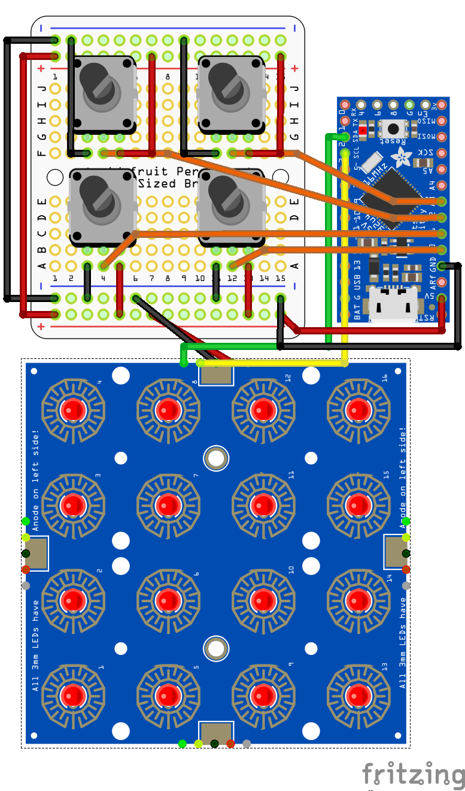

Midi Drum Pad
-------------

A small drum pad with knobs to interface with a digital audio workstation.
This pad was designed for the FL Studio FPC.

### Hardware

1. Microcontroller board with 5V power and pluggable USB, such as an
   [Itsy Bitsy 32u4 5v](https://www.adafruit.com/product/3677). See the
   [MIDIUSB](https://www.arduino.cc/en/Reference/MIDIUSB) docs for more
   information on compatible chips.
2. [Trellis](https://learn.adafruit.com/adafruit-trellis-diy-open-source-led-keypad/overview)
   4x4 keypad controller.
3. [Matching buttons](https://www.adafruit.com/product/1611) for the Trellis.
4. 4 [10k linear potentiometers](https://www.adafruit.com/product/562).
5. 16 [diffused LEDs](https://www.adafruit.com/product/778).
6. [Perma-Proto board](https://www.adafruit.com/product/1608) (optional)

### Circuit

### Usage

Flash midi_controller.ino to the microcontroller. The device will now be
recognized as a USB midicontroller that can be used with a DAW to make some
sick beats.
